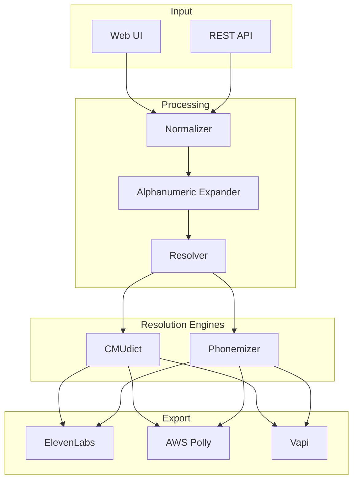
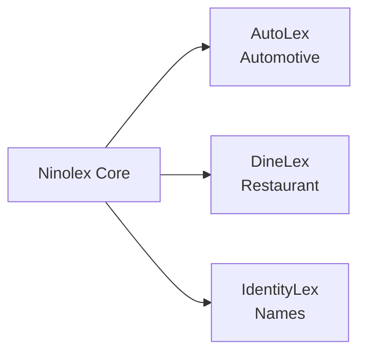

# Ninolex Pipeline Architecture

## Overview



## Pipeline Stages

### 1. Input
- Web UI for manual entry
- REST API for programmatic access
- Batch upload for large dictionaries

### 2. Preprocessing
- **Normalize:** Trim whitespace, handle unicode
- **Expand:** Convert alphanumeric to pronounceable form
  - "WH-1000XM5" → "W H one thousand X M five"

### 3. Resolution
- **Tier 1 (CMUdict):** Fast, reliable for standard English
- **Tier 2 (Phonemizer):** ML-based fallback for unknowns

### 4. Export
- ElevenLabs (W3C PLS)
- AWS Polly (W3C PLS)
- Vapi (JSON)

## Vertical Pack Architecture



Each vertical operates independently, enabling parallel development.

## API Contract

```yaml
POST /api/v1/resolve
Request:
  entities: string[]
  format: "elevenlabs" | "polly" | "vapi"
Response:
  results:
    - grapheme: string
      phoneme: string
      source: string
      confidence: number
  export:
    download_url: string
```
